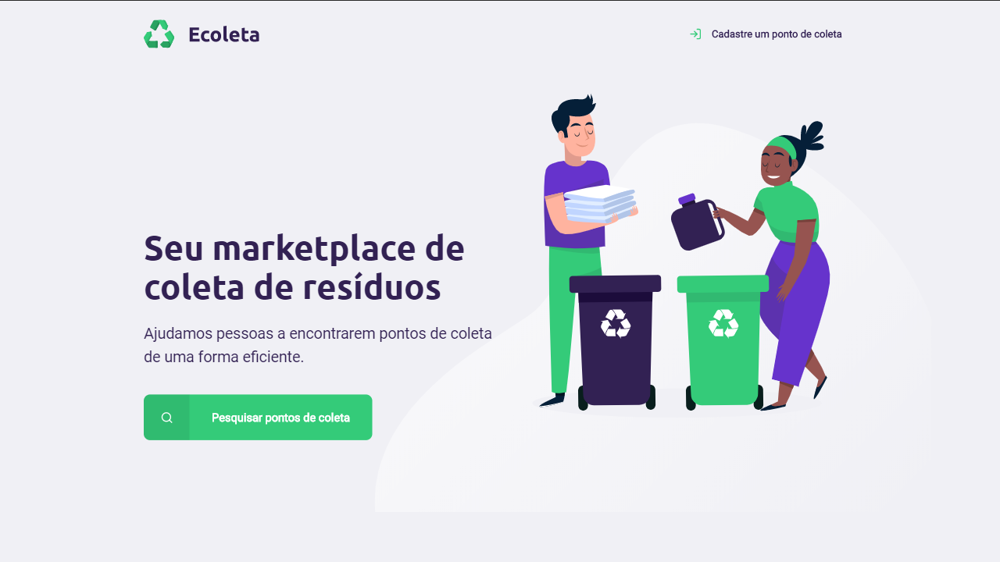
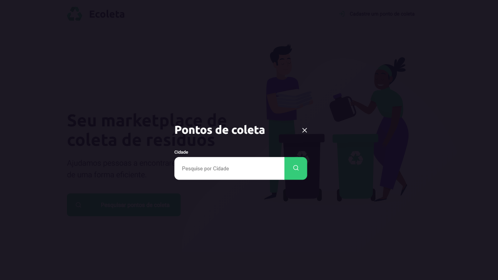
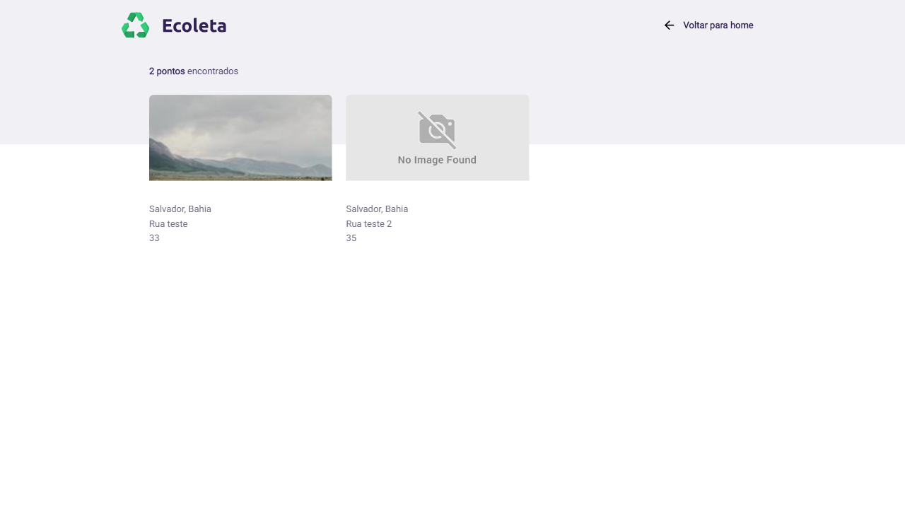
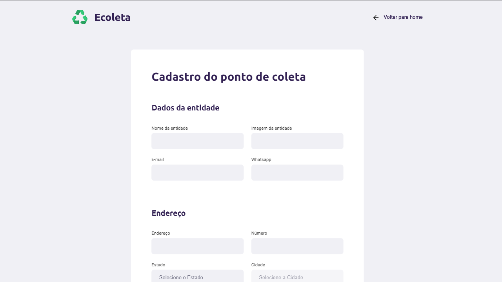
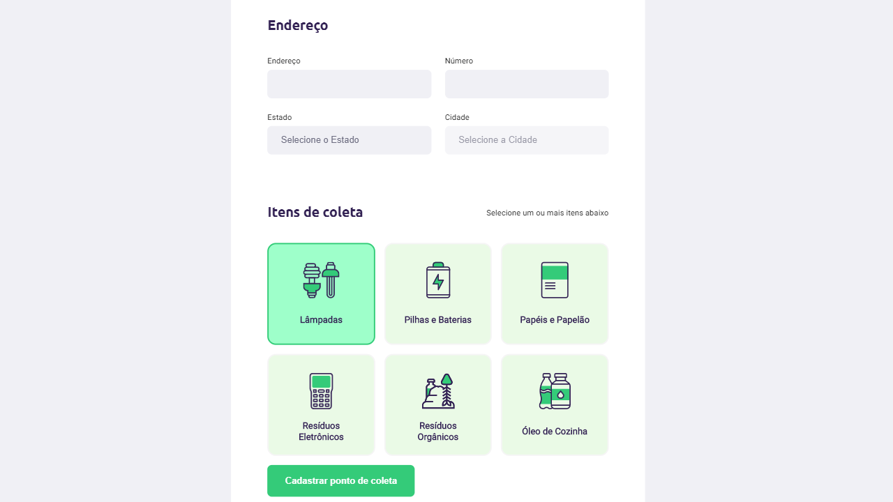
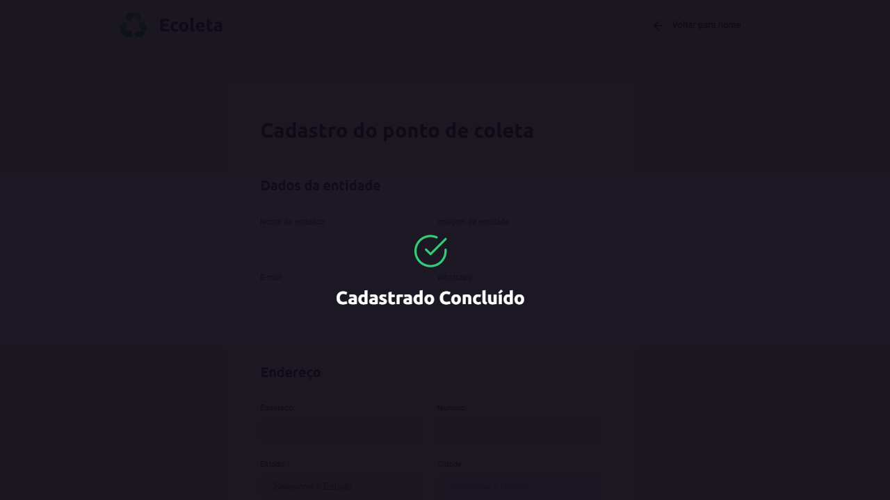

<h1 align="center">
    Next Level Week | NLW#1
</h1>
  
<p align="center">
  
</p>

_________

## ♻️ Sobre o projeto:
O Ecoleta é um projeto para a coleta de lixo. Portanto, pessoas podem encontrar pontos de coleta de lixo e onde descartalos.

## 🚀 Quick start

1.  **Clone o projeto.**

    ```shell
    git clone https://github.com/gabrieljony/next_level_week-01.git
    ```

2.  **Project setup.**

    Instale as dependencias da aplicação.

    ```shell
    cd next_level_week-01/
    npm install
    ```
    
3.  **Compiles.**

    ```shell
    npm start
    ```
    
## 💻 Template













## 💫 Links úteis

[IBGE API](https://servicodados.ibge.gov.br/api/docs)

[API IBGE de Localidades](https://servicodados.ibge.gov.br/api/docs/localidades?versao=1)

## 📝 License

Esse projeto está sob a licença MIT. Veja o arquivo [LICENSE](LICENSE.md) para mais detalhes.

---

<h4 align="center">
    Desenvolvido por <a href="https://www.linkedin.com/in/gabriel-jony/">Gabriel Jony</a>
</h4>


  
